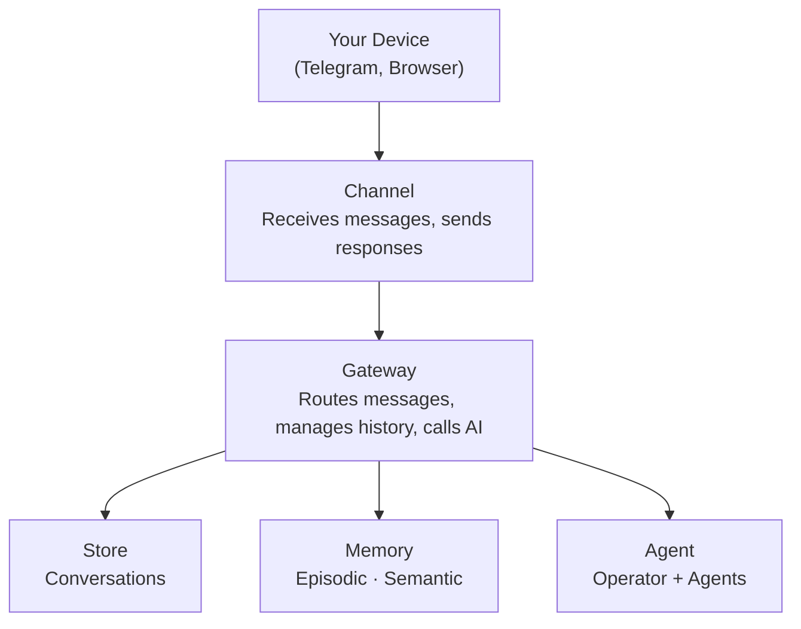
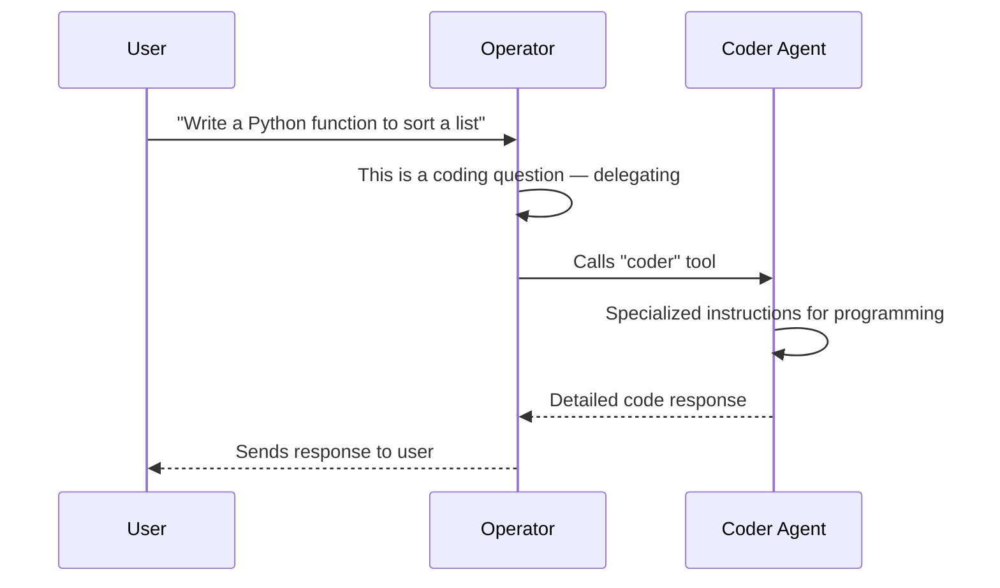

import { FileTree } from 'nextra/components'

# Architecture

This page explains Pandora's internals. You don't need to read this to use Pandora — it's for those who want to understand how it works under the hood.

## Overview



## Components

### Channel

Connects to a messaging platform (Telegram, Web, Discord). Responsibilities:

- Listen for incoming messages
- Convert platform messages to Pandora's `Message` format
- Send responses back to users
- Handle platform-specific formatting

### Gateway

The central hub. Coordinates everything:

1. Acquires a per-conversation lock (messages are queued per conversation)
2. Receives message from channel
3. Saves message to store
4. Loads conversation history
5. Auto-recalls relevant memories (facts + episodes)
6. Sends history + memory context to agent
7. Streams response, persisting parts incrementally
8. Saves response to store
9. Auto-creates an episodic memory (fire-and-forget)
10. Returns response to channel

The Gateway also provides a pub/sub system for [streaming events](/reference/streaming) across channels, and tracks [`ActiveStreamState`](/reference/gateway#activestreamstate) for late-joining subscribers.

### Store

Persists conversation history. Implementations:

- **SQLite** — File-based, persistent
- **Memory** — In-memory, for testing

See [Store Reference](/reference/store) for the interface and storage internals.

### Memory

Provides long-term recall across conversations. Two types:

- **Episodic** — Automatic logging of interactions (gateway-managed)
- **Semantic** — Agent-controlled facts, preferences, knowledge

Uses vector embeddings for semantic search. Episodes are linked to conversations and cleaned up with them.

See [Memory Reference](/reference/memory-reference) for types, interfaces, and internals.

### Agent

The AI brain. Contains:

- **Operator** — Main AI that handles conversations
- **Subagents** — Specialists the operator delegates to

---

## Message flow

What happens when you send "Hello" to Telegram:


---

## Delegation model

The operator can delegate to subagents:



Each subagent appears as a tool to the operator. When called, the Gateway creates a child thread (see [Subagent thread lifecycle](#subagent-thread-lifecycle)) with its own conversation, streams the subagent's response with thread-scoped events, and returns the result to the operator.

---

## Per-conversation locking

The Gateway acquires a **per-conversation lock** before processing each message. This prevents message interleaving when multiple messages arrive for the same conversation in quick succession (e.g., a user sends two messages before the first finishes).

- Messages for the **same conversation** are queued and processed sequentially.
- Messages for **different conversations** are processed in parallel (no contention).
- The lock has a **5-minute timeout** as a safety fallback -- if a handler crashes without releasing the lock, the next queued message proceeds after the timeout and logs a warning.

---

## Request context

The Gateway establishes a `RequestContext` at the start of each message using Node.js `AsyncLocalStorage`. This makes per-request data (conversation ID, channel name) available to any code running within that request — tools, subagents, memory operations — without explicit parameter threading.

```ts
import { requestContext } from "@pandora/core";

// Inside any tool execute, subagent, or helper:
const ctx = requestContext.getStore();
ctx?.conversationId  // current conversation
ctx?.channelName     // originating channel
```

This is concurrency-safe: each request gets its own isolated store, even when multiple conversations are processed in parallel. The context is set via `enterWith()` in `handleMessageStream` and scoped to the async resource of that generator.

The built-in memory tools use this to exclude the current conversation from recall results (avoiding returning information the agent already has in its history).

See [`RequestContext`](/reference/types#request-context) for the type definition.

---

## Subagent thread lifecycle

When the operator delegates to a subagent, the Gateway manages the full thread lifecycle:

### 1. Thread creation (`createThread`)

```
Gateway.createThread(toolCallId, subagentName, prompt)
```

- Creates a child conversation linked to the parent via `toolCallId`
- Creates a user message in the child thread with the delegated prompt
- Creates an assistant message shell for the subagent's response
- Registers a `ThreadContext` for persistence routing
- Emits `subagent-start` event (with `threadId`, `toolCallId`, `subagentName`)

### 2. Subagent streaming

- The subagent streams its response with `threadId` set on all events
- Text deltas, reasoning, sources, and files are persisted to the **child thread's assistant message**
- Tool calls and results are persisted to the **operator's assistant message** (threadId is metadata only)

### 3. Thread completion

- Emits `subagent-done` event (with `threadId`)
- Saves any remaining accumulated reasoning to the thread message
- Finalizes the thread's assistant message
- Cleans up the thread context

Multiple subagent threads can run in parallel -- each gets its own `ThreadContext` and operates independently.

---

## Auto-discovery

Pandora finds extensions at startup:

```
1. Scan packages/pandora/src/tools/*.ts → Register tools
2. Scan packages/pandora/src/subagents/*.ts → Register agents
3. Scan packages/pandora/src/channels/*/index.ts → Register channels
4. Scan packages/pandora/src/store/*.ts → Register storage
5. Load config.jsonc
6. Create enabled components from config
7. Start channels
```

Files starting with `_` are skipped.

---

## Package structure

<FileTree>
  <FileTree.Folder name="packages" defaultOpen>
    <FileTree.Folder name="core — @pandora/core (framework)" defaultOpen>
      <FileTree.Folder name="src" defaultOpen>
        <FileTree.File name="agent.ts — Agent runtime" />
        <FileTree.File name="gateway.ts — Message routing hub" />
        <FileTree.File name="providers.ts — Model factory (createModel, createEmbeddingModel)" />
        <FileTree.File name="config.ts — Config loading/validation" />
        <FileTree.File name="loader.ts — Auto-discovery" />
        <FileTree.Folder name="registries — Extension registries" />
      </FileTree.Folder>
    </FileTree.Folder>
    <FileTree.Folder name="pandora — @pandora/app (your extensions)" defaultOpen>
      <FileTree.Folder name="src" defaultOpen>
        <FileTree.File name="index.ts — Entry point" />
        <FileTree.Folder name="tools — Tool implementations" />
        <FileTree.Folder name="subagents — Subagent definitions" />
        <FileTree.Folder name="channels — Channel implementations" />
        <FileTree.Folder name="store — Storage backends" />
      </FileTree.Folder>
    </FileTree.Folder>
  </FileTree.Folder>
</FileTree>

The separation means you can customize everything in `@pandora/app` without touching core.

---

## AI models and the providers system

Pandora uses the [Vercel AI SDK](https://sdk.vercel.ai) (`ai` v6) with the [Vercel AI Gateway](https://vercel.com/ai-gateway) (`@ai-sdk/gateway`) to access models from any provider through a single API key.

### Model ID format

Every model reference uses the `provider/model` format:

- `google/gemini-3-flash`
- `anthropic/claude-sonnet-4.5`
- `openai/gpt-5.2`
- `perplexity/sonar-pro`
- `openai/text-embedding-3-small`

The provider prefix tells the gateway which backend to route to. Supported providers include OpenAI, Anthropic, Google, Perplexity, Mistral, and any other provider supported by the Vercel AI Gateway.

### How models are created

The providers module (`packages/core/src/providers.ts`) exports two factory functions:

**`createModel(model, apiKey)`** -- Creates a `LanguageModel` instance for chat and text generation. Internally calls `createGateway({ apiKey })` and then invokes the gateway with the model ID string to get a provider-specific model instance.

**`createEmbeddingModel(model, apiKey)`** -- Creates an `EmbeddingModel` instance for vector embeddings. Calls `createGateway({ apiKey })` and then `gateway.textEmbeddingModel(model)` to get an embedding model.

Both functions are called at runtime -- not at startup. Each call to `Agent.chatStream()` creates a fresh `ToolLoopAgent` with a model instance from `createModel()`. Embedding models are created on demand when the memory system needs to generate vectors.

### Where models are used

```
config.jsonc                providers.ts              AI SDK
─────────────              ──────────────            ──────
ai.agents.operator.model → createModel()           → ToolLoopAgent (operator)
ai.agents.coder.model    → createModel()           → ToolLoopAgent (subagent)
ai.agents.*.model        → createModel()           → ToolLoopAgent (subagent)
memory.embeddingModel    → createEmbeddingModel()  → embedMany() for vector search
```

The `ai.gateway.apiKey` is threaded through to every `createModel()` and `createEmbeddingModel()` call. You configure it once and all agents and the memory system use it automatically.
