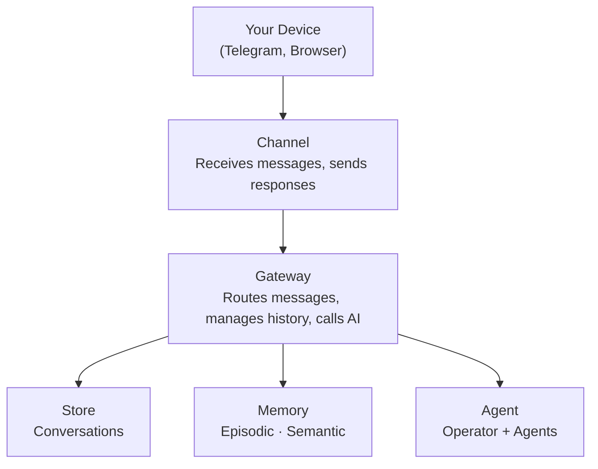
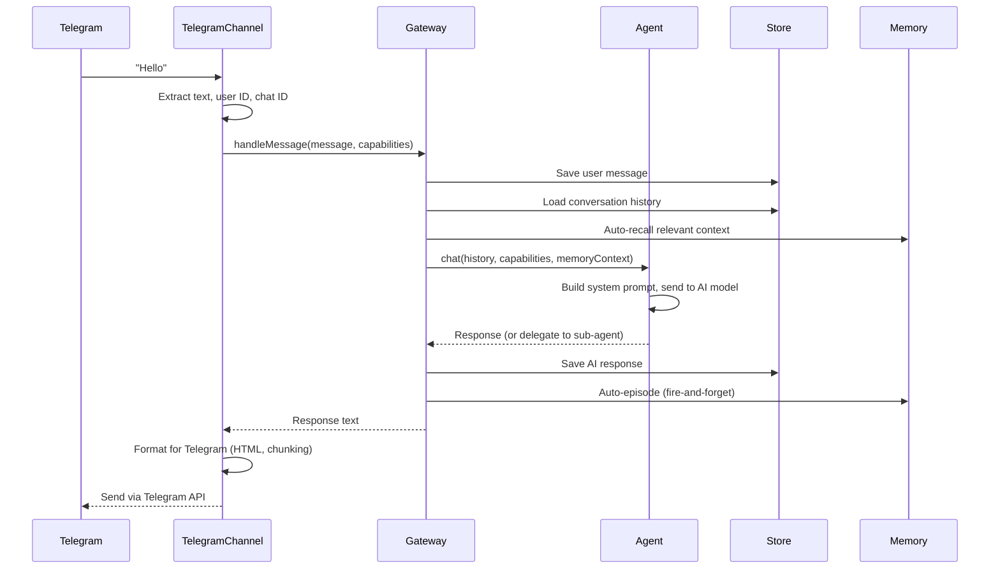
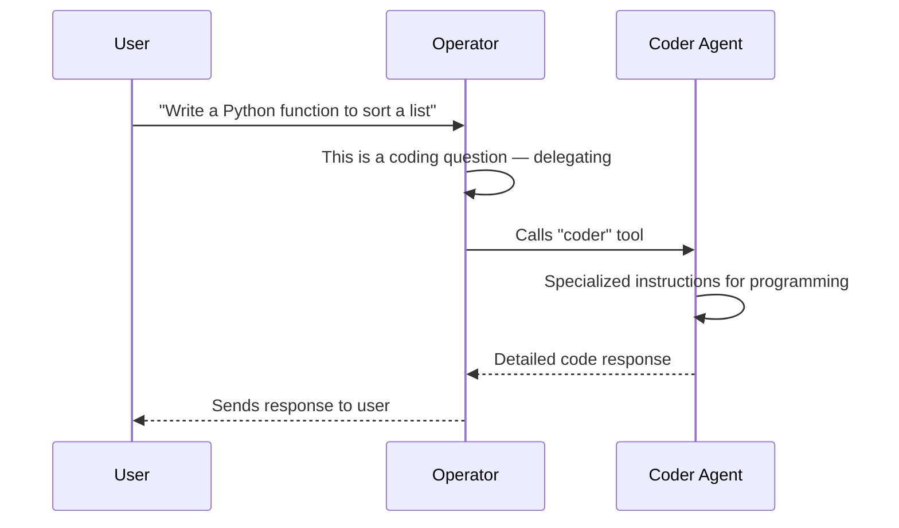

import { FileTree } from 'nextra/components'

# Architecture

This page explains Pandora's internals. You don't need to read this to use Pandora — it's for those who want to understand how it works under the hood.

## Overview



## Components

### Channel

Connects to a messaging platform (Telegram, Web, Discord). Responsibilities:

- Listen for incoming messages
- Convert platform messages to Pandora's `Message` format
- Send responses back to users
- Handle platform-specific formatting

### Gateway

The central hub. Coordinates everything:

1. Acquires a per-conversation lock (messages are queued per conversation)
2. Receives message from channel
3. Saves message to store
4. Loads conversation history
5. Auto-recalls relevant memories (facts + episodes)
6. Sends history + memory context to agent
7. Streams response, persisting parts incrementally
8. Saves response to store
9. Auto-creates an episodic memory (fire-and-forget)
10. Returns response to channel

The Gateway also provides a pub/sub system for streaming events across channels, and tracks `ActiveStreamState` for late-joining subscribers.

### Store

Persists conversation history. Implementations:

- **SQLite** — File-based, persistent
- **Memory** — In-memory, for testing

### Memory

Provides long-term recall across conversations. Two types:

- **Episodic** — Automatic logging of interactions (gateway-managed)
- **Semantic** — Agent-controlled facts, preferences, knowledge

Uses vector embeddings for semantic search. Episodes are linked to conversations and cleaned up with them.

### Agent

The AI brain. Contains:

- **Operator** — Main AI that handles conversations
- **Sub-agents** — Specialists the operator delegates to

---

## Message flow

What happens when you send "Hello" to Telegram:



---

## Delegation model

The operator can delegate to specialists:



Each sub-agent appears as a tool to the operator. When called, the Gateway creates a child thread (see [Subagent thread lifecycle](#subagent-thread-lifecycle)) with its own conversation, streams the subagent's response with thread-scoped events, and returns the result to the operator.

---

## Streaming events

The Gateway emits `StreamEvent`s during message processing, and wraps them as `GatewayEvent`s (adding `conversationId`) for cross-channel pub/sub.

### StreamEvent types

| Event | Description |
|-------|-------------|
| `text-delta` | Text chunk from AI (incremental token) |
| `tool-call` | AI invoking a tool (includes `toolCallId`, `toolName`, `args`) |
| `tool-result` | Tool returned a result (includes `toolCallId`, `toolName`, `result`) |
| `source-url` | Citation: a URL source (includes `sourceId`, `url`, `title`) |
| `source-document` | Citation: a document source (includes `sourceId`, `mediaType`, `title`) |
| `reasoning-delta` | Chain-of-thought text chunk |
| `step-start` | Agent step boundary (beginning of a new step) |
| `step-finish` | Agent step completed (includes `usage` with token counts and `finishReason`) |
| `file` | Generated file (includes `mediaType`, `url`, optional `filename`) |
| `memory-context` | Recalled facts and episodes injected into context (see [Memory integration](#memory-integration-in-the-flow)) |
| `subagent-start` | Subagent thread created (includes `threadId`, `toolCallId`, `subagentName`) |
| `subagent-done` | Subagent thread finished (includes `threadId`) |

### GatewayEvent types

These wrap `StreamEvent`s with a `conversationId` and add a few Gateway-only events:

| Event | Description |
|-------|-------------|
| `user-message` | User sent a message (includes `channelName`, `content`) |
| `done` | Response complete for a conversation |
| `cleared` | Conversation history was cleared |
| `error` | An error occurred (includes `message`) |
| All `StreamEvent`s | Forwarded with `conversationId` added |

Clients subscribe via `gateway.subscribe(conversationId, listener)`.

### Thread scoping

Every `StreamEvent` (except `memory-context`) can carry an optional `threadId` field that scopes it to a subagent thread:

- **`threadId: undefined`** -- Event belongs to the **operator** (main conversation).
- **`threadId: string`** -- Event belongs to a **subagent thread**.
- **Tool events are special**: `tool-call` and `tool-result` **always route to the operator message**, even when they carry a `threadId`. The `threadId` on a tool result is metadata indicating which subagent produced it, not a routing directive.
- **Text, reasoning, and sources** route based on `threadId` presence -- operator or subagent thread accordingly.

This means the UI can render subagent output in a nested thread view while keeping tool calls visible at the operator level.

---

## Per-conversation locking

The Gateway acquires a **per-conversation lock** before processing each message. This prevents message interleaving when multiple messages arrive for the same conversation in quick succession (e.g., a user sends two messages before the first finishes).

- Messages for the **same conversation** are queued and processed sequentially.
- Messages for **different conversations** are processed in parallel (no contention).
- The lock has a **5-minute timeout** as a safety fallback -- if a handler crashes without releasing the lock, the next queued message proceeds after the timeout and logs a warning.

---

## Late-joining subscribers

When a web client connects (or switches tabs) while a conversation is already streaming, it needs to catch up on partial progress. The Gateway maintains an `ActiveStreamState` for each in-progress conversation:

```
ActiveStreamState {
  conversationId, channelName, userContent,
  partialText,     // text accumulated so far
  toolCalls,       // tool calls seen (with results if available)
  sources,         // citations collected
  reasoning,       // accumulated reasoning text
  threads,         // subagent thread states (partialText, status)
  memoryContext,   // recalled facts and episodes
}
```

New subscribers call `gateway.getActiveStreamState(conversationId)` to get a snapshot of the current progress, then receive live events from that point forward. The state is cleared automatically when the stream finishes.

---

## Memory integration in the flow

Memory provides long-term recall across conversations. The Gateway integrates memory automatically at two points:

### Auto-recall (before agent prompt)

When a message arrives, the Gateway searches memory for relevant context:

1. Search with the user's message text (`limit: 10`, `minScore: 0.35`)
2. Deduplicate results by parent (keep highest-scoring chunk per parent memory)
3. Take the top **5 facts** and top **5 episodes**
4. Format them into system instructions:
   - Facts appear under `**Remembered:**` with their category
   - Episodes appear under `**Past interactions:**` with their timestamp
5. Inject as `memoryContext` into the agent prompt
6. Emit a `memory-context` event so the UI can display what was recalled
7. Persist as a `memory-context` part on the assistant message

Memory failures never break chat -- they are caught and logged as warnings.

### Auto-episode (after response)

After the agent finishes responding, the Gateway creates an episodic memory:

1. Combine user message and assistant response into a single episode
2. Store via `memory.episodic.addEpisode()` with conversation metadata
3. This is **fire-and-forget** -- it does not block the response from being returned

When a conversation is deleted, its associated episodic memories are also cleaned up.

---

## Subagent thread lifecycle

When the operator delegates to a subagent, the Gateway manages the full thread lifecycle:

### 1. Thread creation (`createThread`)

```
Gateway.createThread(toolCallId, subagentName, prompt)
```

- Creates a child conversation linked to the parent via `toolCallId`
- Creates a user message in the child thread with the delegated prompt
- Creates an assistant message shell for the subagent's response
- Registers a `ThreadContext` for persistence routing
- Emits `subagent-start` event (with `threadId`, `toolCallId`, `subagentName`)

### 2. Subagent streaming

- The subagent streams its response with `threadId` set on all events
- Text deltas, reasoning, sources, and files are persisted to the **child thread's assistant message**
- Tool calls and results are persisted to the **operator's assistant message** (threadId is metadata only)

### 3. Thread completion

- Emits `subagent-done` event (with `threadId`)
- Saves any remaining accumulated reasoning to the thread message
- Finalizes the thread's assistant message
- Cleans up the thread context

Multiple subagent threads can run in parallel -- each gets its own `ThreadContext` and operates independently.

---

## Cross-channel streaming

The web UI can watch any conversation from any channel:

1. Web UI sends `watch` message with conversation ID
2. Gateway registers the subscription
3. When that conversation gets activity (even from Telegram), events flow to web UI
4. Web UI updates in real-time

This enables:
- Viewing Telegram chats in browser
- Seeing responses stream across channels
- Unified conversation management

---

## Auto-discovery

Pandora finds extensions at startup:

```
1. Scan packages/pandora/src/tools/*.ts → Register tools
2. Scan packages/pandora/src/subagents/*.ts → Register agents
3. Scan packages/pandora/src/channels/*/index.ts → Register channels
4. Scan packages/pandora/src/store/*.ts → Register storage
5. Load config.jsonc
6. Create enabled components from config
7. Start channels
```

Files starting with `_` are skipped.

---

## Package structure

<FileTree>
  <FileTree.Folder name="packages" defaultOpen>
    <FileTree.Folder name="core — @pandora/core (framework)" defaultOpen>
      <FileTree.Folder name="src" defaultOpen>
        <FileTree.File name="agent.ts — Agent runtime" />
        <FileTree.File name="gateway.ts — Message routing hub" />
        <FileTree.File name="providers.ts — Model factory (createModel, createEmbeddingModel)" />
        <FileTree.File name="config.ts — Config loading/validation" />
        <FileTree.File name="loader.ts — Auto-discovery" />
        <FileTree.Folder name="registries — Extension registries" />
      </FileTree.Folder>
    </FileTree.Folder>
    <FileTree.Folder name="pandora — @pandora/app (your extensions)" defaultOpen>
      <FileTree.Folder name="src" defaultOpen>
        <FileTree.File name="index.ts — Entry point" />
        <FileTree.Folder name="tools — Tool implementations" />
        <FileTree.Folder name="subagents — Sub-agent definitions" />
        <FileTree.Folder name="channels — Channel implementations" />
        <FileTree.Folder name="store — Storage backends" />
      </FileTree.Folder>
    </FileTree.Folder>
  </FileTree.Folder>
</FileTree>

The separation means you can customize everything in `@pandora/app` without touching core.

---

## AI models and the providers system

Pandora uses the [Vercel AI SDK](https://sdk.vercel.ai) (`ai` v6) with the [Vercel AI Gateway](https://vercel.com/ai-gateway) (`@ai-sdk/gateway`) to access models from any provider through a single API key.

### Model ID format

Every model reference uses the `provider/model` format:

- `google/gemini-3-flash` (recommended for operator)
- `anthropic/claude-sonnet-4.5` (recommended for coder)
- `openai/gpt-5.2` (recommended for research)
- `perplexity/sonar-pro` (recommended for web search)
- `openai/text-embedding-3-small` (recommended for memory embeddings)

The provider prefix tells the gateway which backend to route to. Supported providers include OpenAI, Anthropic, Google, Perplexity, Mistral, and any other provider supported by the Vercel AI Gateway.

### How models are created

The providers module (`packages/core/src/providers.ts`) exports two factory functions:

**`createModel(model, apiKey)`** -- Creates a `LanguageModel` instance for chat and text generation. Internally calls `createGateway({ apiKey })` and then invokes the gateway with the model ID string to get a provider-specific model instance.

**`createEmbeddingModel(model, apiKey)`** -- Creates an `EmbeddingModel` instance for vector embeddings. Calls `createGateway({ apiKey })` and then `gateway.textEmbeddingModel(model)` to get an embedding model.

Both functions are called at runtime -- not at startup. Each call to `Agent.chatStream()` creates a fresh `ToolLoopAgent` with a model instance from `createModel()`. Embedding models are created on demand when the memory system needs to generate vectors.

### Where models are used

```
config.jsonc                providers.ts              AI SDK
─────────────              ──────────────            ──────
ai.agents.operator.model → createModel()           → ToolLoopAgent (operator)
ai.agents.coder.model    → createModel()           → ToolLoopAgent (subagent)
ai.agents.*.model        → createModel()           → ToolLoopAgent (subagent)
memory.embeddingModel    → createEmbeddingModel()  → embedMany() for vector search
```

The `ai.gateway.apiKey` is threaded through to every `createModel()` and `createEmbeddingModel()` call. You configure it once and all agents and the memory system use it automatically.
