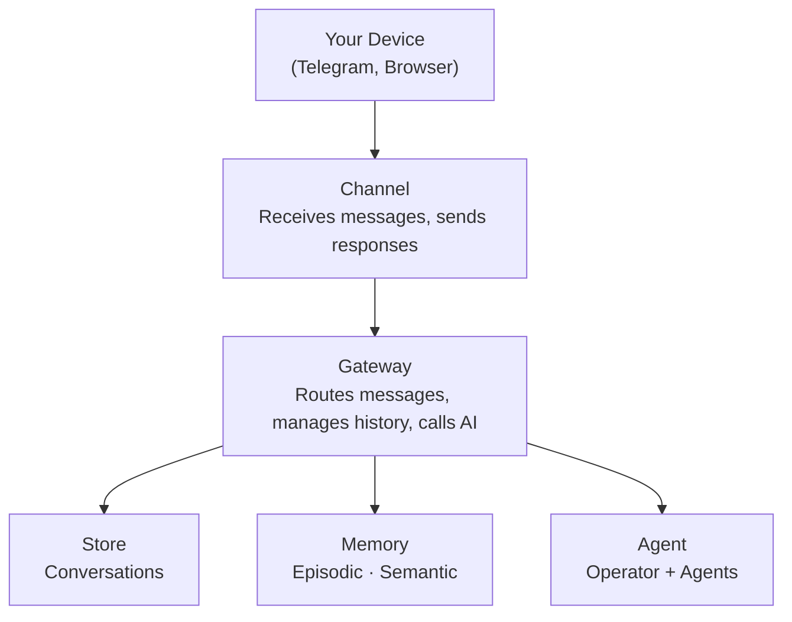
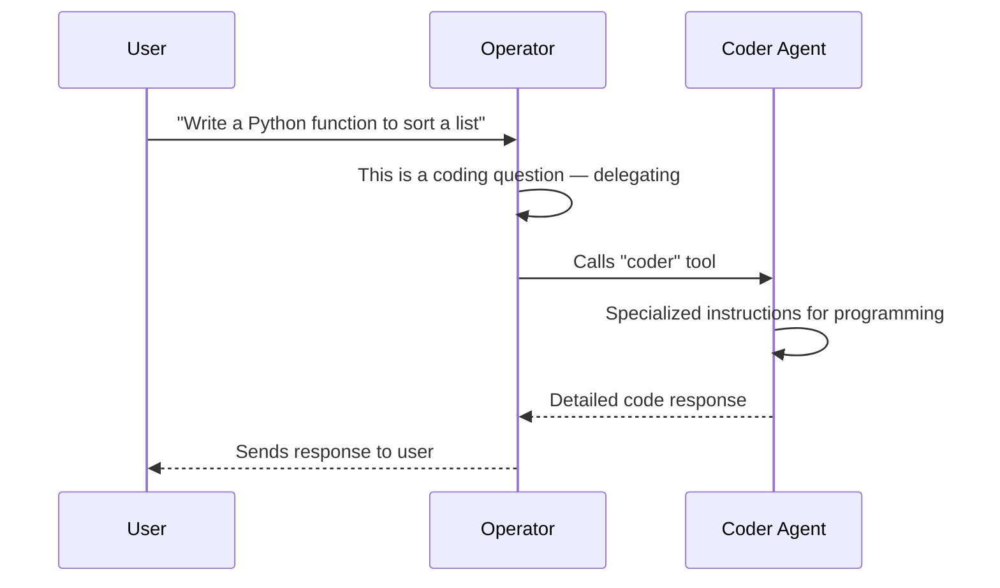

import { FileTree } from 'nextra/components'

# Architecture

This page explains Pandora's internals. You don't need to read this to use Pandora — it's for those who want to understand how it works under the hood.

## Overview



## Components

### Channel

Connects to a messaging platform (Telegram, Web, Discord). Responsibilities:

- Listen for incoming messages
- Convert platform messages to Pandora's `Message` format
- Send responses back to users
- Handle platform-specific formatting

### Gateway

The central hub. Coordinates everything:

1. Acquires a per-conversation lock (messages are queued per conversation)
2. Receives message from channel
3. Saves message to store
4. Loads conversation history
5. Auto-recalls relevant memories (facts + episodes)
6. Sends history + memory context to agent
7. Streams response, persisting parts incrementally
8. Saves response to store
9. Auto-creates an episodic memory (fire-and-forget)
10. Returns response to channel

The Gateway also provides a pub/sub system for streaming events across channels, and tracks `ActiveStreamState` for late-joining subscribers.

### Store

Persists conversation history. Implementations:

- **SQLite** — File-based, persistent
- **Memory** — In-memory, for testing

### Memory

Provides long-term recall across conversations. Two types:

- **Episodic** — Automatic logging of interactions (gateway-managed)
- **Semantic** — Agent-controlled facts, preferences, knowledge

Uses vector embeddings for semantic search. Episodes are linked to conversations and cleaned up with them.

### Agent

The AI brain. Contains:

- **Operator** — Main AI that handles conversations
- **Subagents** — Specialists the operator delegates to

---

## Message flow

What happens when you send "Hello" to Telegram:


---

## Delegation model

The operator can delegate to subagents:



Each subagent appears as a tool to the operator. When called, the Gateway creates a child thread (see [Subagent thread lifecycle](#subagent-thread-lifecycle)) with its own conversation, streams the subagent's response with thread-scoped events, and returns the result to the operator.

---

## Streaming events

The Gateway emits `StreamEvent`s during message processing, and wraps them as `GatewayEvent`s (adding `conversationId`) for cross-channel pub/sub.

### StreamEvent types

| Event | Description |
|-------|-------------|
| `text-delta` | Text chunk from AI (incremental token) |
| `tool-call` | AI invoking a tool (includes `toolCallId`, `toolName`, `args`) |
| `tool-result` | Tool returned a result (includes `toolCallId`, `toolName`, `result`) |
| `source-url` | Citation: a URL source (includes `sourceId`, `url`, `title`) |
| `source-document` | Citation: a document source (includes `sourceId`, `mediaType`, `title`) |
| `reasoning-delta` | Chain-of-thought text chunk |
| `step-start` | Agent step boundary (beginning of a new step) |
| `step-finish` | Agent step completed (includes `usage` with token counts and `finishReason`) |
| `file` | Generated file (includes `mediaType`, `url`, optional `filename`) |
| `memory-context` | Recalled facts and episodes injected into context (see [Memory integration](#memory-integration-in-the-flow)) |
| `subagent-start` | Subagent thread created (includes `threadId`, `toolCallId`, `subagentName`) |
| `subagent-done` | Subagent thread finished (includes `threadId`) |

### GatewayEvent types

These wrap `StreamEvent`s with a `conversationId` and add a few Gateway-only events:

| Event | Description |
|-------|-------------|
| `user-message` | User sent a message (includes `channelName`, `content`) |
| `done` | Response complete for a conversation |
| `cleared` | Conversation history was cleared |
| `error` | An error occurred (includes `message`) |
| All `StreamEvent`s | Forwarded with `conversationId` added |

Clients subscribe via `gateway.subscribe(conversationId, listener)`.

### Thread scoping

Every `StreamEvent` (except `memory-context`) can carry an optional `threadId` field that scopes it to a subagent thread:

- **`threadId: undefined`** -- Event belongs to the **operator** (main conversation).
- **`threadId: string`** -- Event belongs to a **subagent thread**.
- **Tool events are special**: `tool-call` and `tool-result` **always route to the operator message**, even when they carry a `threadId`. The `threadId` on a tool result is metadata indicating which subagent produced it, not a routing directive.
- **Text, reasoning, and sources** route based on `threadId` presence -- operator or subagent thread accordingly.

This means the UI can render subagent output in a nested thread view while keeping tool calls visible at the operator level.

---

## Per-conversation locking

The Gateway acquires a **per-conversation lock** before processing each message. This prevents message interleaving when multiple messages arrive for the same conversation in quick succession (e.g., a user sends two messages before the first finishes).

- Messages for the **same conversation** are queued and processed sequentially.
- Messages for **different conversations** are processed in parallel (no contention).
- The lock has a **5-minute timeout** as a safety fallback -- if a handler crashes without releasing the lock, the next queued message proceeds after the timeout and logs a warning.

---

## Late-joining subscribers

When a web client connects (or switches tabs) while a conversation is already streaming, it needs to catch up on partial progress. The Gateway maintains an `ActiveStreamState` for each in-progress conversation:

```
ActiveStreamState {
  conversationId, channelName, userContent,
  partialText,     // text accumulated so far
  toolCalls,       // tool calls seen (with results if available)
  sources,         // citations collected
  reasoning,       // accumulated reasoning text
  threads,         // subagent thread states (partialText, status)
  memoryContext,   // recalled facts and episodes
}
```

New subscribers call `gateway.getActiveStreamState(conversationId)` to get a snapshot of the current progress, then receive live events from that point forward. The state is cleared automatically when the stream finishes.

---

## Memory integration in the flow

Memory provides long-term recall across conversations. The Gateway integrates memory automatically at two points:

### Auto-recall (before agent prompt)

When a message arrives, the Gateway searches memory for relevant context:

1. Search with the user's message text (`limit: 8`, `minScore: 0.50`, excluding episodes from the current conversation)
2. Deduplicate results by parent (keep highest-scoring chunk per parent memory)
3. Take the top **3 facts** and top **2 episodes**
4. Format them as **truncated hints** (120 chars) with parent IDs:
   - Facts appear under `**Remembered:**` with their category and ID
   - Episodes appear under `**Past interactions:**` with their timestamp and ID
   - A footer instructs the agent to use `getMemory` with the ID for full content
5. Inject as `memoryContext` into the agent prompt
6. Emit a `memory-context` event so the UI can display what was recalled
7. Persist as a `memory-context` part on the assistant message

This keeps the system prompt lightweight. The agent can pull full details on-demand via `getMemory(id)`.

Memory failures never break chat -- they are caught and logged as warnings.

### Auto-episode (after response)

After the agent finishes responding, the Gateway creates an episodic memory:

1. Combine user message and assistant response into a single episode
2. Store via `memory.episodic.addEpisode()` with conversation metadata
3. This is **fire-and-forget** -- it does not block the response from being returned

When a conversation is deleted, its associated episodic memories are also cleaned up.

---

## Subagent thread lifecycle

When the operator delegates to a subagent, the Gateway manages the full thread lifecycle:

### 1. Thread creation (`createThread`)

```
Gateway.createThread(toolCallId, subagentName, prompt)
```

- Creates a child conversation linked to the parent via `toolCallId`
- Creates a user message in the child thread with the delegated prompt
- Creates an assistant message shell for the subagent's response
- Registers a `ThreadContext` for persistence routing
- Emits `subagent-start` event (with `threadId`, `toolCallId`, `subagentName`)

### 2. Subagent streaming

- The subagent streams its response with `threadId` set on all events
- Text deltas, reasoning, sources, and files are persisted to the **child thread's assistant message**
- Tool calls and results are persisted to the **operator's assistant message** (threadId is metadata only)

### 3. Thread completion

- Emits `subagent-done` event (with `threadId`)
- Saves any remaining accumulated reasoning to the thread message
- Finalizes the thread's assistant message
- Cleans up the thread context

Multiple subagent threads can run in parallel -- each gets its own `ThreadContext` and operates independently.

---

## Cross-channel streaming

The web UI can watch any conversation from any channel:

1. Web UI sends `watch` message with conversation ID
2. Gateway registers the subscription
3. When that conversation gets activity (even from Telegram), events flow to web UI
4. Web UI updates in real-time

This enables:
- Viewing Telegram chats in browser
- Seeing responses stream across channels
- Unified conversation management

---

## Auto-discovery

Pandora finds extensions at startup:

```
1. Scan packages/pandora/src/tools/*.ts → Register tools
2. Scan packages/pandora/src/subagents/*.ts → Register agents
3. Scan packages/pandora/src/channels/*/index.ts → Register channels
4. Scan packages/pandora/src/store/*.ts → Register storage
5. Load config.jsonc
6. Create enabled components from config
7. Start channels
```

Files starting with `_` are skipped.

---

## Package structure

<FileTree>
  <FileTree.Folder name="packages" defaultOpen>
    <FileTree.Folder name="core — @pandora/core (framework)" defaultOpen>
      <FileTree.Folder name="src" defaultOpen>
        <FileTree.File name="agent.ts — Agent runtime" />
        <FileTree.File name="gateway.ts — Message routing hub" />
        <FileTree.File name="providers.ts — Model factory (createModel, createEmbeddingModel)" />
        <FileTree.File name="config.ts — Config loading/validation" />
        <FileTree.File name="loader.ts — Auto-discovery" />
        <FileTree.Folder name="registries — Extension registries" />
      </FileTree.Folder>
    </FileTree.Folder>
    <FileTree.Folder name="pandora — @pandora/app (your extensions)" defaultOpen>
      <FileTree.Folder name="src" defaultOpen>
        <FileTree.File name="index.ts — Entry point" />
        <FileTree.Folder name="tools — Tool implementations" />
        <FileTree.Folder name="subagents — Subagent definitions" />
        <FileTree.Folder name="channels — Channel implementations" />
        <FileTree.Folder name="store — Storage backends" />
      </FileTree.Folder>
    </FileTree.Folder>
  </FileTree.Folder>
</FileTree>

The separation means you can customize everything in `@pandora/app` without touching core.

---

## Storage Internals

The SQLite storage provider persists conversations, messages, and message parts. See [SQLite Storage](/storage/sqlite) for configuration.

<details>
<summary>**Schema: conversations, messages, message_parts**</summary>

**conversations** — Holds both top-level user conversations and subagent threads.

```sql
CREATE TABLE conversations (
  id TEXT PRIMARY KEY,
  channel_name TEXT,
  user_id TEXT,
  type TEXT NOT NULL DEFAULT 'root',       -- 'root' | 'subagent'
  parent_conversation_id TEXT,              -- FK → conversations.id (subagent threads only)
  parent_tool_call_id TEXT,                 -- tool call that spawned this thread
  subagent_name TEXT,                       -- e.g. 'coder', 'research'
  created_at INTEGER NOT NULL DEFAULT (unixepoch()),
  updated_at INTEGER NOT NULL DEFAULT (unixepoch()),
  FOREIGN KEY (parent_conversation_id) REFERENCES conversations(id) ON DELETE CASCADE
);

-- Fast parent lookup for child threads
CREATE INDEX idx_conversations_parent ON conversations (parent_conversation_id);
```

| Column | Purpose |
|--------|---------|
| `type` | `'root'` for user conversations, `'subagent'` for delegated threads |
| `parent_conversation_id` | Links a subagent thread back to its parent conversation |
| `parent_tool_call_id` | The tool call ID that triggered the subagent delegation |
| `subagent_name` | Which subagent owns this thread |

**messages** — Metadata for each message. Content lives in `message_parts`.

```sql
CREATE TABLE messages (
  id TEXT PRIMARY KEY,
  conversation_id TEXT NOT NULL,            -- FK → conversations.id
  role TEXT NOT NULL,                        -- 'user' | 'assistant'
  channel_name TEXT,
  input_tokens INTEGER NOT NULL DEFAULT 0,
  output_tokens INTEGER NOT NULL DEFAULT 0,
  total_tokens INTEGER NOT NULL DEFAULT 0,
  created_at INTEGER NOT NULL DEFAULT (unixepoch()),
  FOREIGN KEY (conversation_id) REFERENCES conversations(id) ON DELETE CASCADE
);

CREATE INDEX idx_messages_conversation ON messages (conversation_id, created_at);
```

**message_parts** — Ordered, heterogeneous content parts for each message.

```sql
CREATE TABLE message_parts (
  id INTEGER PRIMARY KEY AUTOINCREMENT,
  message_id TEXT NOT NULL,                 -- FK → messages.id
  part_index INTEGER NOT NULL,
  part_type TEXT NOT NULL,                  -- 'text' | 'dynamic-tool'
  part_data TEXT NOT NULL,                  -- JSON blob
  created_at INTEGER NOT NULL DEFAULT (unixepoch()),
  FOREIGN KEY (message_id) REFERENCES messages(id) ON DELETE CASCADE
);

CREATE INDEX idx_parts_message ON message_parts (message_id, part_index);
```

**Part types:**

| `part_type` | `part_data` contains |
|-------------|---------------------|
| `text` | `{ type: "text", text: "...", state: "streaming" \| "done" }` |
| `dynamic-tool` | `{ type: "dynamic-tool", toolCallId, toolName, input, state, output?, threadId? }` |

</details>

<details>
<summary>**Streaming persistence flow**</summary>

During a streaming response, the store is updated incrementally so progress is never lost:

1. **`createMessage(conversationId, role)`** -- creates an empty message shell (no parts yet).
2. **`appendPart(messageId, part)`** -- adds a text or tool-call part with the next index.
3. **`updateTextPart(messageId, text)`** -- replaces the text content of the last text part as deltas arrive.
4. **`updateToolResult(messageId, toolCallId, result)`** -- sets `state: "output-available"` and writes the tool output when the tool finishes.
5. **`finalizeMessage(messageId)`** -- flips all text parts from `state: "streaming"` to `state: "done"`.
6. **`accumulateUsage(messageId, usage)`** -- adds token counts (input, output, total) to the message row. Accumulated across multi-step tool loops.

</details>

<details>
<summary>**Subagent thread storage**</summary>

When the agent delegates work to a subagent, a child conversation is created:

| Method | Purpose |
|--------|---------|
| `createSubagentConversation(parentId, toolCallId, subagentName)` | Creates a child conversation with `type: 'subagent'` |
| `linkToolToThread(messageId, toolCallId, threadId)` | Adds `threadId` to the parent's tool-call part so the UI can link to it |
| `getChildThreads(conversationId)` | Returns all subagent conversations for a parent |

**Conversation types:**

- **root** -- Top-level conversations initiated by users from any channel.
- **subagent** -- Thread spawned by a tool-call delegation. Has `parent_conversation_id`, `parent_tool_call_id`, and `subagent_name` set.

Subagent threads are excluded from `listConversations()` results so they don't clutter the conversation list. They are only accessible through `getChildThreads()` on their parent.

</details>

---

## Memory Internals

The SQLite memory provider stores episodic and semantic memories with vector embeddings for hybrid search. See [Memory](/memory) for configuration and [SQLite Memory](/memory/sqlite) for backend setup.

<details>
<summary>**Database schema**</summary>

The database runs in WAL mode with foreign keys enabled. Six tables make up the schema:

```sql
-- Episodic memory (interaction logs)
CREATE TABLE memory_episodes (
  id TEXT PRIMARY KEY,
  content TEXT NOT NULL,
  conversation_id TEXT,
  channel_name TEXT,
  user_id TEXT,
  timestamp INTEGER NOT NULL,
  importance REAL DEFAULT 0.5,
  tags TEXT                       -- JSON array of strings
);

-- Semantic memory (facts / knowledge)
CREATE TABLE memory_facts (
  id TEXT PRIMARY KEY,
  content TEXT NOT NULL,
  category TEXT NOT NULL,         -- 'user_preference' | 'knowledge' | 'instruction'
  created_at INTEGER NOT NULL,
  updated_at INTEGER NOT NULL,
  source TEXT,
  confidence REAL DEFAULT 1.0
);

-- Chunks with embeddings (for both episodes and facts)
CREATE TABLE memory_chunks (
  id TEXT PRIMARY KEY,
  parent_id TEXT NOT NULL,        -- FK to episode or fact
  parent_type TEXT NOT NULL       -- 'episode' | 'fact'
    CHECK(parent_type IN ('episode', 'fact')),
  content TEXT NOT NULL,
  vector TEXT NOT NULL,           -- JSON array of floats
  start_offset INTEGER NOT NULL,
  end_offset INTEGER NOT NULL,
  chunk_index INTEGER NOT NULL
);

-- FTS5 full-text search index (content-synced with memory_chunks)
CREATE VIRTUAL TABLE memory_chunks_fts USING fts5(
  content,
  content='memory_chunks',
  content_rowid='rowid'
);

-- sqlite-vec vector index for KNN search
CREATE VIRTUAL TABLE vec_chunks USING vec0(
  chunk_id TEXT PRIMARY KEY,
  embedding float[1536]
);
```

Triggers keep `memory_chunks_fts` automatically synchronized with `memory_chunks` on
insert, update, and delete.

**Indices:**

| Index | Column(s) |
|-------|-----------|
| `idx_episodes_timestamp` | `memory_episodes.timestamp DESC` |
| `idx_facts_category` | `memory_facts.category` |
| `idx_chunks_parent` | `memory_chunks(parent_id, parent_type)` |

</details>

<details>
<summary>**Chunking strategy**</summary>

Content is split into overlapping chunks before embedding using the tiktoken library
with the `cl100k_base` encoding (GPT-4 / text-embedding-3 tokenizer).

| Parameter | Value | Purpose |
|-----------|-------|---------|
| Target size | ~400 tokens | Optimal embedding window |
| Overlap | 80 tokens | Context continuity between chunks |
| Minimum size | 50 tokens | Avoids tiny trailing chunks (merged into previous) |

**Splitting algorithm:**

1. If the text fits within the target size (≤400 tokens), return it as a single chunk.
2. Split text on sentence boundaries (`.`, `!`, `?` followed by whitespace) to keep chunks semantically coherent.
3. Accumulate sentences until the running token count reaches the target.
4. Emit a chunk, then start the next chunk with enough trailing sentences to provide ~80 tokens of overlap.
5. If the final remaining text is below the minimum (50 tokens), merge it into the previous chunk instead of creating a tiny chunk.

Each chunk carries position metadata (`startOffset`, `endOffset`, `chunkIndex`) so the
original text location is recoverable.

</details>

<details>
<summary>**Hybrid search algorithm**</summary>

Every search query runs two scoring passes and merges the results.

**1. Vector search (70% weight)**

Uses the `sqlite-vec` extension for KNN indexed lookup (O(log n) instead of brute-force O(n)).
The query text is embedded, then matched against `vec_chunks` using L2 distance.
L2 distance is converted to a 0-1 similarity score:

```
similarity = max(0, 1 - distance^2 / 2)
```

The KNN query is isolated in a CTE (per sqlite-vec documentation) so the `LIMIT`
constraint is respected, then JOINed to `memory_chunks` to filter by `parent_type`.

**2. BM25 keyword search (30% weight)**

Uses the FTS5 `MATCH` operator with BM25 scoring on `memory_chunks_fts`.
Query text is sanitized before matching: quotes and newlines are removed, words are
extracted and stripped of leading/trailing punctuation, then joined with `OR` for
flexible matching. Malformed queries that cause FTS5 errors are caught gracefully and
return empty results.

Raw BM25 scores are min-max normalized to a 0-1 range.

**3. Score merging**

```
finalScore = 0.7 * vectorScore + 0.3 * bm25Score
```

Scores from both passes are merged across the union of all matching chunk IDs.
Chunks missing from one pass receive a score of 0 for that component.
Results below the `minScore` threshold (default 0.5) are discarded.

</details>

<details>
<summary>**Fact deduplication**</summary>

When `upsertFact()` is called, the first chunk of the new fact is compared against the
first chunks of all existing facts using cosine similarity.

- **Threshold:** 0.92
- If an existing fact has similarity >= 0.92, its content, category, source, and
  confidence are updated in place and its chunks are re-embedded.
- If no match is found, a new fact is created.

This prevents near-duplicate facts from accumulating over time.

</details>

<details>
<summary>**Episodic memory operations**</summary>

| Method | Description |
|--------|-------------|
| `addEpisode(episode)` | Inserts the episode record, chunks the content, batch embeds all chunks, stores chunks in `memory_chunks` + `vec_chunks` (FTS5 entries are auto-synced via triggers). |
| `searchEpisodes(query, opts?)` | Runs hybrid search (vector + BM25). Supports optional `since` timestamp filter and `minScore` / `limit` options. |
| `getEpisode(id)` | Fetches a single episode by ID. |
| `deleteEpisode(id)` | Deletes the episode and all its chunks (from `memory_chunks`, `vec_chunks`, and FTS5). |
| `deleteEpisodesForConversation(conversationId)` | Bulk-deletes all episodes for a conversation and their associated chunks. Returns the count of deleted episodes. |

</details>

<details>
<summary>**Semantic memory operations**</summary>

| Method | Description |
|--------|-------------|
| `upsertFact(fact)` | Smart upsert with cosine-similarity deduplication (threshold 0.92). Chunks content, batch embeds, then either updates an existing fact or creates a new one. |
| `searchFacts(query, opts?)` | Runs hybrid search (vector + BM25). Supports optional `category` filter and `minScore` / `limit` options. |
| `getFact(id)` | Fetches a single fact by ID. |
| `deleteFact(id)` | Deletes the fact and all its chunks. |

</details>

<details>
<summary>**Unified search**</summary>

The top-level `search(query, opts?)` method runs `searchEpisodes` and `searchFacts`
in parallel (via `Promise.all`) and returns combined results as `{ episodes, facts }`.

</details>

---

## AI models and the providers system

Pandora uses the [Vercel AI SDK](https://sdk.vercel.ai) (`ai` v6) with the [Vercel AI Gateway](https://vercel.com/ai-gateway) (`@ai-sdk/gateway`) to access models from any provider through a single API key.

### Model ID format

Every model reference uses the `provider/model` format:

- `google/gemini-3-flash`
- `anthropic/claude-sonnet-4.5`
- `openai/gpt-5.2`
- `perplexity/sonar-pro`
- `openai/text-embedding-3-small`

The provider prefix tells the gateway which backend to route to. Supported providers include OpenAI, Anthropic, Google, Perplexity, Mistral, and any other provider supported by the Vercel AI Gateway.

### How models are created

The providers module (`packages/core/src/providers.ts`) exports two factory functions:

**`createModel(model, apiKey)`** -- Creates a `LanguageModel` instance for chat and text generation. Internally calls `createGateway({ apiKey })` and then invokes the gateway with the model ID string to get a provider-specific model instance.

**`createEmbeddingModel(model, apiKey)`** -- Creates an `EmbeddingModel` instance for vector embeddings. Calls `createGateway({ apiKey })` and then `gateway.textEmbeddingModel(model)` to get an embedding model.

Both functions are called at runtime -- not at startup. Each call to `Agent.chatStream()` creates a fresh `ToolLoopAgent` with a model instance from `createModel()`. Embedding models are created on demand when the memory system needs to generate vectors.

### Where models are used

```
config.jsonc                providers.ts              AI SDK
─────────────              ──────────────            ──────
ai.agents.operator.model → createModel()           → ToolLoopAgent (operator)
ai.agents.coder.model    → createModel()           → ToolLoopAgent (subagent)
ai.agents.*.model        → createModel()           → ToolLoopAgent (subagent)
memory.embeddingModel    → createEmbeddingModel()  → embedMany() for vector search
```

The `ai.gateway.apiKey` is threaded through to every `createModel()` and `createEmbeddingModel()` call. You configure it once and all agents and the memory system use it automatically.
